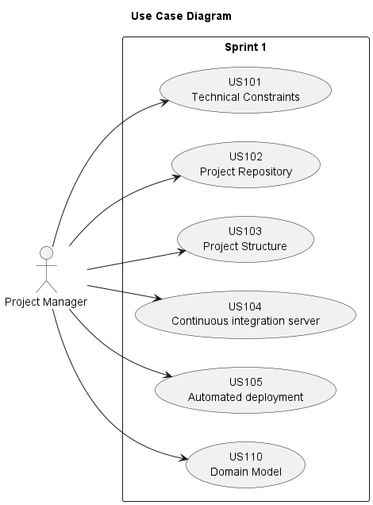

# Use Case Diagram (UCD)

**In the scope of this project, there is a direct relationship of _1 to 1_ between Use Cases (UC) and User Stories (US).**

[//]: # ( However, be aware, this is a pedagogical simplification. On further projects and course units there may also exist _1 to N **and/or** N to 1_ relationships between UC and US.)

[//]: # (**Insert below the Use Case Diagram in a SVG format**)

[//]: # (**For each UC/US, it must be provided evidences of applying main activities of the software development process &#40;requirements, analysis, design, tests and code&#41;. Gather those evidences on a separate file for each UC/US and set up a link as suggested below.**)

# Use Cases / User Stories

| UC/US | Description                                            |                   
|:------|:-------------------------------------------------------|
| US101 | [Technical constraints](../../us101/Readme.md)         |
| US102   | [Project Repository](../../us102/Readme.md)            |
| US103   | [Project Structure](../../US103/Readme.md)             | 
| US104   | [Continuous integration server](../../US104/Readme.md) |
| US105   | [Automated deployment](../../us105/Readme.md)          |
| US110   | [Domain Model](../../US110/Readme.md)                  |
